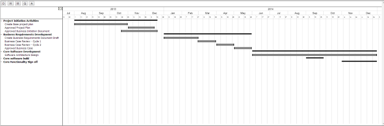

Jquery-Gantt
============

A Gantt Plugin using Jquery, Backbone and Kinetic

### Jquery-Gantt
This jquery-gantt plugin utilises additional jquery libraries of [Backbone.js](http://backbonejs.org/) and [Kineticjs](http://kineticjs.com/)

The development is still early stages, however the end result would be a Gantt plugin that allows for complex Project Gantt charts, dependency and resource assignments. Data is being read from structured json files that should allow integration to any backend technologies such as .net, php, java etc.

### Current State of Development
Jquery-gantt currently reads in json files from a static source, and outputs the results in a gantt style chart to a broswer screen. 

Line items can be
*  grouped to 3 levels
*  dependencies created between items
*  gantt bars moved to change dates
*  gantt bars resized
*  different view options, Day, Week, Month, Quarter, Annual
*  Expandable table section for additional line item details

### Work Required?
If you prefer to not use the automatic generator, push a branch named `gh-pages` to your repository to create a page manually. In addition to supporting regular HTML content, GitHub Pages support Jekyll, a simple, blog aware static site generator written by our own Tom Preston-Werner. Jekyll makes it easy to create site-wide headers and footers without having to copy them across every page. It also offers intelligent blog support and other advanced templating features.

### Authors and Contributors
You can @mention a GitHub username to generate a link to their profile. The resulting `<a>` element will link to the contributor's GitHub Profile. For example: In 2007, Chris Wanstrath (@defunkt), PJ Hyett (@pjhyett), and Tom Preston-Werner (@mojombo) founded GitHub.

### Support or Contact
Having trouble with Pages? Check out the documentation at http://help.github.com/pages or contact support@github.com and we’ll help you sort it out.
