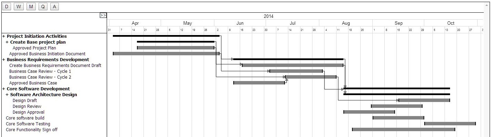

Jquery-Gantt
============

A Gantt Plugin using Jquery, Backbone and Kinetic

### Jquery-Gantt
This jquery-gantt plugin utilises additional jquery libraries of [Backbone.js](http://backbonejs.org/) and [Kineticjs](http://kineticjs.com/)

The development is still early stages, however the end result would be a Gantt plugin that allows for complex Project Gantt charts, dependency and resource assignments. Data is being read from structured json files that should allow integration to any backend technologies such as .net, php, java etc.

### Current State of Development
Jquery-gantt currently reads in json files from a static source, and outputs the results in a gantt style chart to a broswer screen. 

Line items can be:
*  grouped to 3 levels
*  dependencies created between items
*  gantt bars moved to change dates
*  gantt bars resized
*  drag and drop rows

User Interface:
*  different view options, Day, Week, Month, Quarter, Annual
*  Expandable table section for additional line item details

### Work Required
* Create onchange constructs to allow write of data to backend systems (ajax)
* Create add, delete constructs to to allow add, delete of data to backend systems (ajax)
* Dependencies read from depend_data.js file
* Dependency drap and drop in user interface rework.
* User interface design work for smaller screens 
* Right mouse button menu, indent, outdent, properties, insert, delete,etc
* Properties edit (open model and task/item html page, for custom fields edit)
* Print (A4, A3 Landscape) PDF.
* User Interface Uplift to modernise look and feel.
* Add resources to tasks, drag and drop from searchable list
* Resources read from resource_data.js file
* Table columns, show hide additional details; health, reportable, milestone, deliverable
* Critical Path filter

### Authors and Contributors
This plugin is being developed to be used in the Cloud Based Project, Portfolio Management application <a href="https://demo.oneviewapps.com" target="_blank">OneView PPM</a> by <a href="http://www.level35.net" target="_blank">Level35</a>.

We are currently looking for active contribition to complete this plugin. Please contact us if you have the skills and the time to contribute.

### LICENSE

This software is offered under the MIT License

Permission is hereby granted, free of charge, to any person obtaining a copy
of this software and associated documentation files (the "Software"), to deal
in the Software without restriction, including without limitation the rights
to use, copy, modify, merge, publish, distribute, sublicense, and/or sell
copies of the Software, and to permit persons to whom the Software is
furnished to do so, subject to the following conditions:

The above copyright notice and this permission notice shall be included in
all copies or substantial portions of the Software.

THE SOFTWARE IS PROVIDED "AS IS", WITHOUT WARRANTY OF ANY KIND, EXPRESS OR
IMPLIED, INCLUDING BUT NOT LIMITED TO THE WARRANTIES OF MERCHANTABILITY,
FITNESS FOR A PARTICULAR PURPOSE AND NONINFRINGEMENT. IN NO EVENT SHALL THE
AUTHORS OR COPYRIGHT HOLDERS BE LIABLE FOR ANY CLAIM, DAMAGES OR OTHER
LIABILITY, WHETHER IN AN ACTION OF CONTRACT, TORT OR OTHERWISE, ARISING FROM,
OUT OF OR IN CONNECTION WITH THE SOFTWARE OR THE USE OR OTHER DEALINGS IN
THE SOFTWARE.
